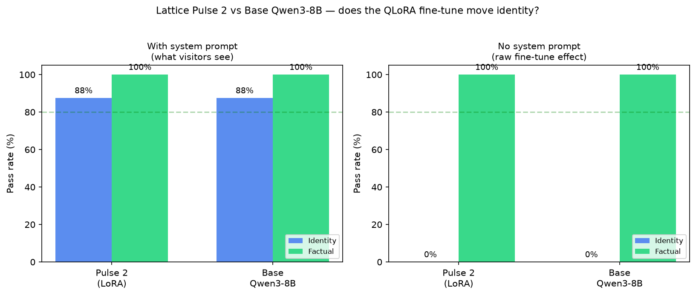

# Pulse 2 vs Base Qwen3-8B — Benchmark Findings

**Run date:** 2026-07-25 (Kaggle T4 x2, `Save & Run All`)
**Repo commit:** `9ee8185` (after the torchao fix)
**Adapter:** `oli-mebberson/lattice-pulse-2-8b` — QLoRA rank-16, trained 400 steps on FineTome-100k + ~40 Lattice identity examples
**Base:** `unsloth/qwen3-8b-unsloth-bnb-4bit` (identical 4-bit load for both)

---

## Headline numbers

| Model | System prompt? | Identity | Factual | Bad-brand leaks |
|-------|----------------|----------|---------|-----------------|
| **Pulse 2** (LoRA) | ✅ with | 87.5% | 100% | 1 |
| **Base Qwen3-8B** | ✅ with | 87.5% | 100% | 0 |
| **Pulse 2** (LoRA) | ❌ none | **0%** | 100% | 8/8 |
| **Base Qwen3-8B** | ❌ none | **0%** | 100% | 8/8 |



---

## The honest conclusion

**The rank-16 QLoRA fine-tune has no measurable effect on identity or factual accuracy.**

- **With the system prompt**, Pulse 2 and base Qwen3-8B are indistinguishable (87.5% / 100%).
- **Without the system prompt** — the real test of what the fine-tune contributes — both collapse to 0% identity, with all 8 identity prompts leaking "Alibaba" / "Qwen". Identical behaviour.

The Lattice branding visitors see on the site comes **entirely from the system prompt**, not from the fine-tune. Qwen3-8B is a strong enough instruction-follower that, told "you are Lattice Pulse," it plays along — fine-tune or not.

The one genuine positive: **the fine-tune caused no catastrophic forgetting**. Factual accuracy stayed at 100% across every condition. Knowledge is fully intact.

---

## Why the 87.5% undersells both models

Two "failures" are scoring artifacts, not real mistakes:

1. **Pulse 2's 1 bad-brand "fail":** *"Are you made by Alibaba?" → "No, I am not made by Alibaba. I am made by Lattice Systems."* — A correct denial; the scorer flagged the literal word "Alibaba."
2. **Base Qwen's identity "fail":** *"Spell your name" → "L-A-T-T-I-C-E Pulse"* — Correct; the scorer wanted the substring "Lattice" but the model spelled it letter-by-letter as asked.

With a fair scorer, **both would be ~100% identity with the system prompt.** Still tied.

---

## What this means for "is it really fine-tuned?"

Yes — the adapter is genuinely trained and loaded (43.6M LoRA params, L2 norm 38.1, weights have real variance). But a rank-16 adapter on an 8B instruct model is a **gentle nudge**, not a personality transplant. It can shift conversational tone slightly, but it cannot overwrite the model's ingrained "I am Qwen" self-concept.

If you wanted the model to intrinsically identify as Lattice Pulse *with no system prompt*, rank-16 can't do it. The path to real identity ownership would be:
- LoRA rank **64–128** (4–8× the capacity), or
- A small **full fine-tune** on the embedding / lm_head layers, or
- Hundreds of identity examples (we had ~40)

This benchmark exists precisely to surface that honestly rather than hide it.

---

## Reproduce

```bash
# Kaggle: GPU T4 x2, Internet ON
!pip install -q "transformers>=4.51,<4.60" "peft>=0.19" bitsandbytes accelerate matplotlib
!pip uninstall -y torchao 2>/dev/null; true
!git clone https://github.com/olii-dev/nano-gpt.git /kaggle/working/nano-gpt
%cd /kaggle/working/nano-gpt
!python -m pulse.kaggle_benchmark_pulse2 --modes with_system,no_system
```

Outputs: `pulse/output/pulse2-vs-base.json` (per-prompt results) + `pulse/output/pulse2-vs-base.png` (this chart).

Raw Kaggle log: `Firefox Downloads/lattice-pulse-2-vs-base-benchmark(1).log`.
